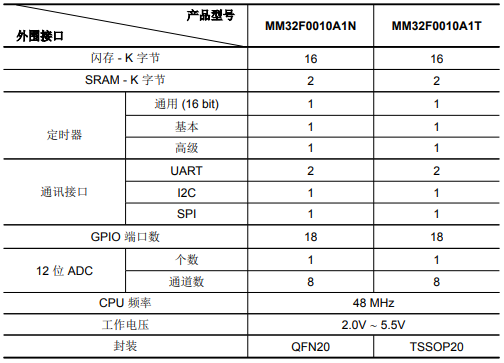

# [MM32F0010](https://github.com/SoCXin/MM32F0010)

#### [Vendor](https://github.com/SoCXin/Vendor)：[MindMotion](http://www.mindmotion.com.cn)
#### [Core](https://github.com/SoCXin/Cortex)：[Cortex M0](https://github.com/SoCXin/CM0)
#### [Level](https://github.com/SoCXin/Level)：48MHz

[MM32F0010](https://github.com/SoCXin/MM32F0010)

#### 关键特性

* PIN2PIN兼容替换003

### [资源收录](https://github.com/SoCXin)

* [参考文档](docs/)
* [参考资源](src/)
* [参考工程](project/)

### [选型建议](https://github.com/SoCXin)

[MM32F0010](https://github.com/SoCXin/MM32F0010)

* [MM32F031](https://github.com/SoCXin/MM32F031)
* [MM32F013](https://github.com/SoCXin/MM32F013)
* [MM32F003](https://github.com/SoCXin/MM32F003)

###  [www.SoC.xin(芯)](http://www.SoC.Xin)
