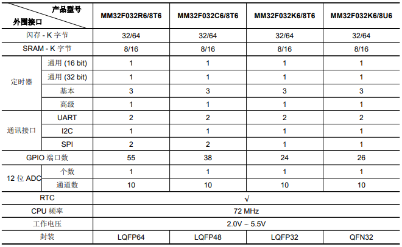

# [MM32F032](https://github.com/SoCXin/MM32F032)

#### [Vendor](https://github.com/SoCXin/Vendor)：[MindMotion](http://www.mm32.com.cn/)
#### [Core](https://github.com/SoCXin/Cortex)：[Cortex M0](https://github.com/SoCXin/CM0)
#### [Level](https://github.com/SoCXin/Level)：72MHz

## [描述](https://github.com/SoCXin/MM32F032/wiki)

[MM32F032](https://github.com/SoCXin/MM32F032)提供4种封装规格和2种容量规格，系列有8个型号，主要用于填充[MM32F031](https://github.com/SoCXin/MM32F031)和[MM32F103](https://github.com/SoCXin/MM32F103)之间的空白。

### [资源收录](https://github.com/SoCXin/MM32F032)

* [文档](docs/)
* [资源](src/)

### [选型建议](https://github.com/SoCXin)

* [MM32F031](https://github.com/SoCXin/MM32F031)规格兼容向下，封装全面，适用于低端产品，没有RTC
* [MM32F032](https://github.com/SoCXin/MM32F032)具有RTC，规格低于[MM32F103](https://github.com/SoCXin/MM32F103)

###  [SoC芯平台](http://www.SoC.Xin)
